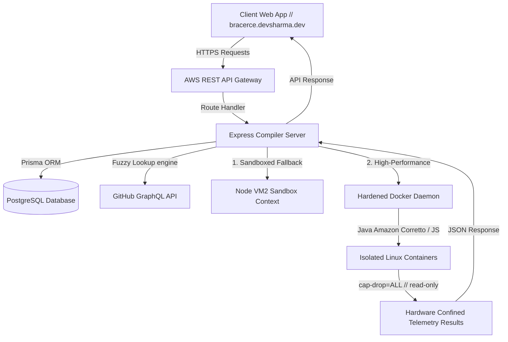

# 📐 BRACE RCE // ONLINE IDE & TELEMETRY ENGINE

<div align="center">

```
==============================================================================
   ____    ____     ____         _____      ____     ____    _____
  |  _ \  |  _ \   / __ \   / __ \  | ____|  / __ \   / __ \  | ____|
  | |_) | | |_) | | /  \ | | /  \/  | |__   | /  \/  | /  \/  | |__
  |  _ <  |  _ <  | |  | | | |      |  __|  | |      | |      |  __|
  | |_) | | | \ \ | \__/ | | \__/\  | |___  | \__/\  | \__/\  | |___
  |____/  |_|  \_\ \____/   \____/  |_____|  \____/   \____/  |_____
==============================================================================
                    // SYS // REMOTE_CODE_EXECUTION_IDE
```

[](https://bracerce.devsharma.dev)
[](https://github.com/Devsharma08/ONLINE_IDE)
[](https://github.com/Devsharma08/DSA-LEETCODE)

</div>

---

## // OVERVIEW

**BraceRCE** (`bracerce.devsharma.dev`) is a high-density, ultra-premium Futuristic/Fantasy User Interface (FUI) web application and remote compiler engine. It is engineered to bridge the gap between learning theoretical structures and practicing real-time competitive algorithms. 

By combining the native capabilities of modern web browsers with isolated secure execution containers on AWS, BraceRCE compiles, executes, and profiles competitive code templates on-demand, supplying high-precision telemetry insights instantly.

---

## ⚡ KEY FEATURES

### 1. Side-by-Side Problem Workspace
*   **Premium Monaco Editor:** A workspace equipped with protected boilerplate regions ( driver classes and test runners locked from editing) and a customizable monospaced formatting engine.
*   **Interactive Multi-Filter Sidebar:** Instant text, language (Java, JavaScript), and data structure category filters that process repository listings seamlessly in real-time.
*   **Fuzzy Synchronicity Engine:** Leverages optimized Levenshtein distance calculations and substring matches to automatically sync custom file templates with database-seeded problems.

### 2. Symmetrical 8-Structure Bento Grid & Concept Pages
*   **Hand-Crafted 14x14 Concept Pixel Arts:** Trees, graphs, arrays, lists, queues, geometry waves, and timeline sweeps modeled in high-contrast cyan-to-coral gradients.
*   **Hover-Only Easing Loops:** Grid elements remain perfectly static and optimized by default, sparking subtle vertical hover-floats and shimmering animations *only* under active cursor bounds.
*   **Deep Concept Sheets:** Instantly routes to dedicated structure detail viewports complete with time/space complexity matrices and production-ready applications.

### 3. Secure sandboxed telemetry compiler
*   **Dynamic Container Executions:** Standard solutions compile inside hardened AWS Docker shells, complete with real-time logging, expected-output diff displays, and status diagnostics.
*   **Free-Form Scratchpad:** Compiles arbitrary, customized code scripts with empty-stdin fallbacks and custom diagnostics, fully bypassing LeetCode test suite comparison barriers.

---

## 🏗️ SYSTEM ARCHITECTURE



---

## 🔒 SECURITY HARDENING MATRIX

To guarantee maximum protection against malicious scripts, thread-locking, and container breakout vectors, the Remote Execution Engine implements a strict, multi-layered security grid:

| Security Boundary | Action Taken | Mitigated Exploits |
| :--- | :--- | :--- |
| **IP-Based Rate Limiting** | `express-rate-limit` capped at **15 executions/minute** | Application-layer Denial of Service (DoS), infinite loop abuse |
| **Linux Capability Stripping** | Injected Docker `--cap-drop=ALL` flags | Container escapes, kernel modification exploits |
| **Filesystem Lockdown** | Mounted root volumes under `--read-only` configurations | Malware downloads, script persistency, temp file pollution |
| **Isolated Memory Scratch** | Configured dynamic, RAM-confined `--tmpfs /tmp` directories | Unauthorized host file writes, compile-time storage leaks |
| **Global Context Masking** | Excluded `fs`, `child_process`, and `http` from local `vm` scripts | Offline breakout exploits, internal process inspection |
| **Header Shielding** | Disabled default branding signatures (`app.disable("x-powered-by")`) | Version profiling, scanner-based target exploits |

---

## 🚀 LOCAL DEVELOPMENT SETUP

The application is architected as an ultra-clean monorepo split into two primary components: the Vite client application (`/`) and the Express remote code compiler (`/server`).

### Prerequisites
*   [Node.js](https://nodejs.org) (v18+)
*   [pnpm](https://pnpm.io) (v8+)
*   [Docker Desktop](https://www.docker.com/products/docker-desktop) (Optional - required for backend Java compilations)
*   [PostgreSQL](https://www.postgresql.org) (Optional - Prisma seeds will fallback to sandbox mock states if offline)

---

### Step 1: Clone the Repository & Install Dependencies
```bash
git clone https://github.com/Devsharma08/ONLINE_IDE.git
cd ONLINE_IDE

# Install full-stack dependencies recursively
pnpm install
```

---

### Step 2: Configure Environment Variables

#### Client Configuration
Create a `.env` file in the root folder (`/`):
```env
VITE_API_URL=http://localhost:5000
VITE_GITHUB_REPO_URL=https://github.com/Devsharma08/DSA-LEETCODE
```

#### Server Configuration
Create a `.env.development` file inside the server folder (`/server`):
```env
PORT=5000
DATABASE_URL="postgresql://<user>:<password>@<host>:<port>/<db>?schema=public"
DIRECT_URL="postgresql://<user>:<password>@<host>:<port>/<db>?schema=public"
GITHUB_TOKEN="your_personal_access_token_for_graphql"
```

---

### Step 3: Initialize Database & Seed Problems
```bash
cd server

# Run Prisma schema migrations
npx prisma db push

# Populate problem difficulties, classifications, and templates
pnpm run seed
```

---

### Step 4: Run the Development Servers
Open two terminal windows in the project root:

**Terminal 1 (Vite Frontend):**
```bash
pnpm dev
```
*Frontend hot-reloads live on `http://localhost:5173`*

**Terminal 2 (Express Backend):**
```bash
cd server
pnpm dev
```
*Server hot-reloads dynamically via tsx watch on `http://localhost:5000`*

---

## 🎨 FUTURE SCOPE CONTRIBUTION ROADMAP
We partition our codebase deterministically: the core compiler engine code runs in [ONLINE_IDE](https://github.com/Devsharma08/ONLINE_IDE), and the LeetCode challenge templates populate from [DSA-LEETCODE](https://github.com/Devsharma08/DSA-LEETCODE). 

If you are interested in expanding systems security boundaries, adding runtime environments (C++, Rust, Go), or styling monospaced dashboards:
1. Fork [DSA-LEETCODE](https://github.com/Devsharma08/DSA-LEETCODE) to add new algorithmic problem templates.
2. Fork [ONLINE_IDE](https://github.com/Devsharma08/ONLINE_IDE) to submit compiler optimization PRs.
3. Open an issue detailing your system concept or implementation plan!

---

## 📄 LICENSE
Distributed under the MIT License. See `LICENSE` inside the repository for further details.

***
<div align="center">
  <sub>SYS // COMPILER_ONLINE // BRACERCE // DEVSHARMA.DEV</sub>
</div>
